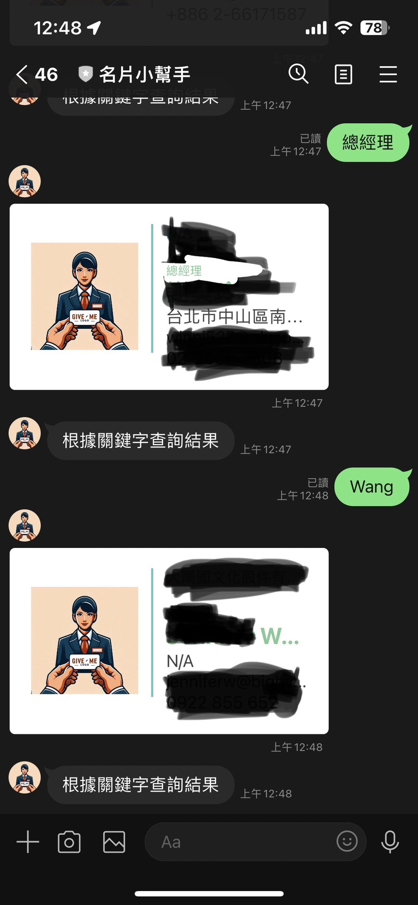

LINE Bot 使用 Google Gemini Pro 跟 Firebase Database 來做的名片小幫手
---

     

### LINE Bot Screen

#### Add new card into DB

#### Search keyword by Neural Language

## 如何快速架設在自己平台

請根據以下的流程，來直接透過開源的程式碼來架設一個 LINEBot 跟 GCP  STT 與 GCS (Google Cloud Storage) 的結合。

### 事前準備

- [LINE Developers 帳號](https://developers.line.biz/console/)
  - 到 [LINE Developers Console](https://developers.line.biz/console/) 透過你的 LINE 帳號登入。
  - 開啟 LINE Developers 帳號
  - 開啟一個官方帳號 Message API Channel 並且取得 `channel secret` 與 `channel access token`。 請[參考這篇教學](https://developers.line.biz/en/docs/messaging-api/getting-started/#using-console)。
- 需要一個收費的 [Google Cloud Platform](https://cloud.google.com/) 帳號，並且取得 GCP JSON key file ，更多詳細流程請參考 [Cloud Storage client libraries](https://cloud.google.com/storage/docs/reference/libraries)。

### 開始部署

- 參考本篇設定文章 - [[BwAI workshop][Golang] LINE OA + CloudFunction + GeminiPro + Firebase = 旅行小幫手 LINE 聊天機器人(2)： Firebase Database 讓 LINEBot 有個超長記憶](https://www.evanlin.com/linebot-cloudfunc-firebase-gemini-workshop2/)

### 如何使用

- **傳送名片照片：** 會自動透過 Gemini Pro 辨識之後，將結果上傳到 Firebase Database.
- **查詢名片**： 可以透過口語的方式來查詢名片。（e.g. 幫我找在 LINE 工作的人)

### 完整開發教學

- [[BwAI workshop][Golang] LINE OA + CloudFunction + GeminiPro + Firebase = 旅行小幫手 LINE 聊天機器人(1)： 景色辨識小幫手](https://www.evanlin.com/linebot-cloudfunc-firebase-gemini-workshop/)
- [[BwAI workshop][Golang] LINE OA + CloudFunction + GeminiPro + Firebase = 旅行小幫手 LINE 聊天機器人(2)： Firebase Database 讓 LINEBot 有個超長記憶](https://www.evanlin.com/linebot-cloudfunc-firebase-gemini-workshop2/)

License
---------------

Licensed under the Apache License, Version 2.0 (the "License");
you may not use this file except in compliance with the License.
You may obtain a copy of the License at

<http://www.apache.org/licenses/LICENSE-2.0>

Unless required by applicable law or agreed to in writing, software
distributed under the License is distributed on an "AS IS" BASIS,
WITHOUT WARRANTIES OR CONDITIONS OF ANY KIND, either express or implied.
See the License for the specific language governing permissions and
limitations under the License.
